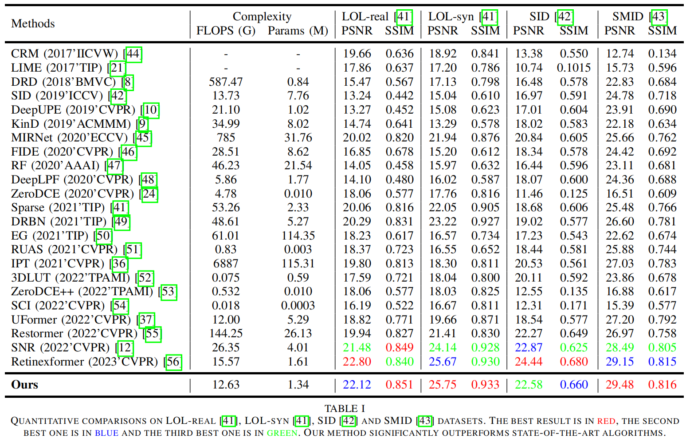
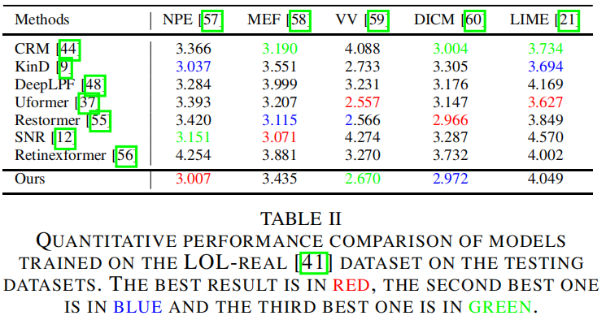
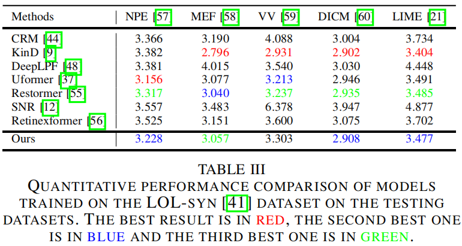

# Learning-to-Brighten-from-Attention

### Results
- Results on LOL-real, LOL-syn, SID and SMID datasets can be downloaded from [Google Drive](https://drive.google.com/drive/folders/1u0RaFEhRBZAQOIOJ9T3Q3czUVMl5-YXT?usp=sharing)

- Results of models trained on the LOL-real dataset on LIME, NPE, MEF, DICM, and VV datasets can be downloaded from [Google Drive](https://drive.google.com/drive/folders/1tCT7U3sIUb-O60xzgqV43J6IjJKZfHA9?usp=sharing)

- Results of models trained on the LOL-syn dataset on LIME, NPE, MEF, DICM, and VV datasets can be downloaded from [Google Drive](https://drive.google.com/drive/folders/1p6CkkTkw0EmwQy2IM6M_Ns_jXGlW4q-U?usp=sharing)
  

<b>Performance on LOL-real, LOL-syn, SID and SMID:</b>

<b>Performance of models trained on the LOL-real dataset on LIME, NPE, MEF, DICM, and VV:</b>

<b>Performance of models trained on the LOL-syn dataset on LIME, NPE, MEF, DICM, and VV:</b>

